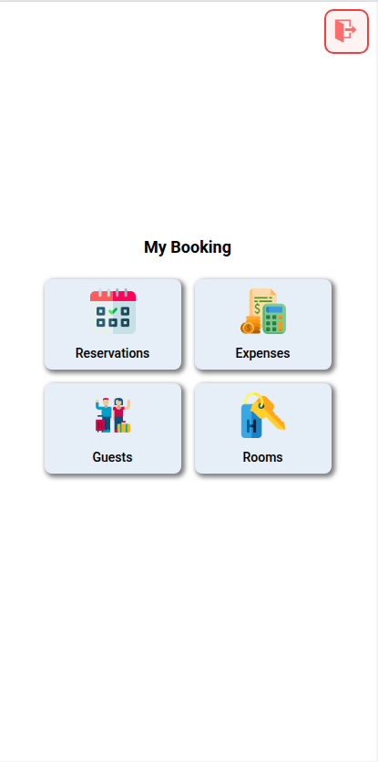
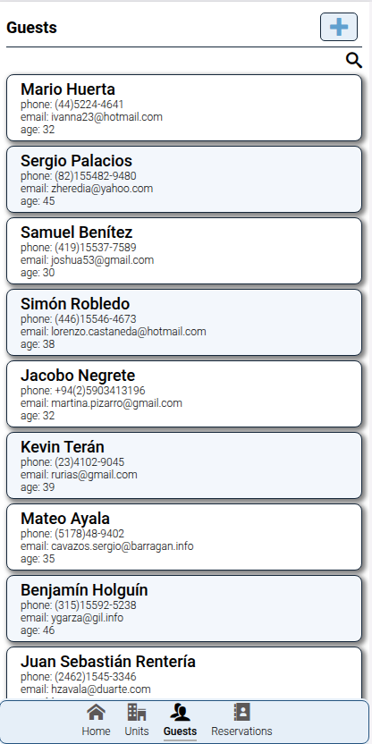
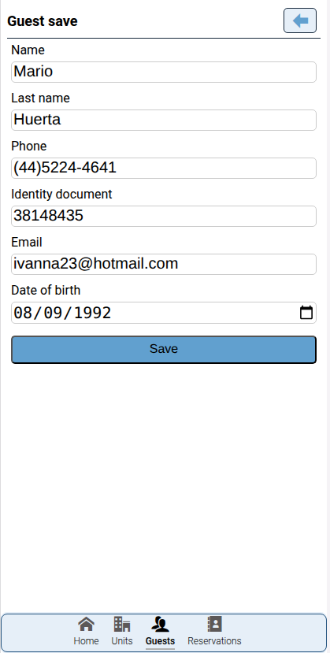
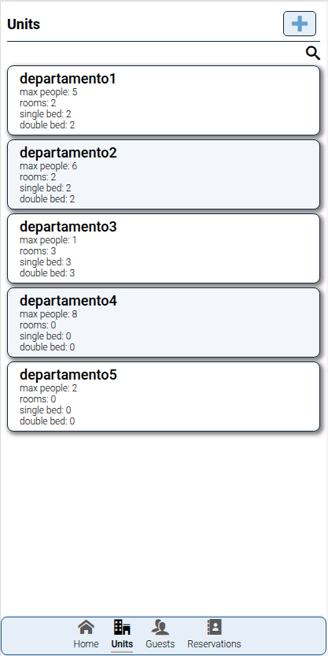
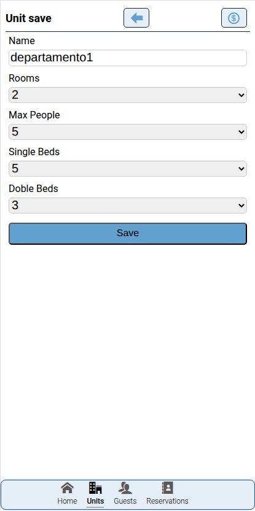
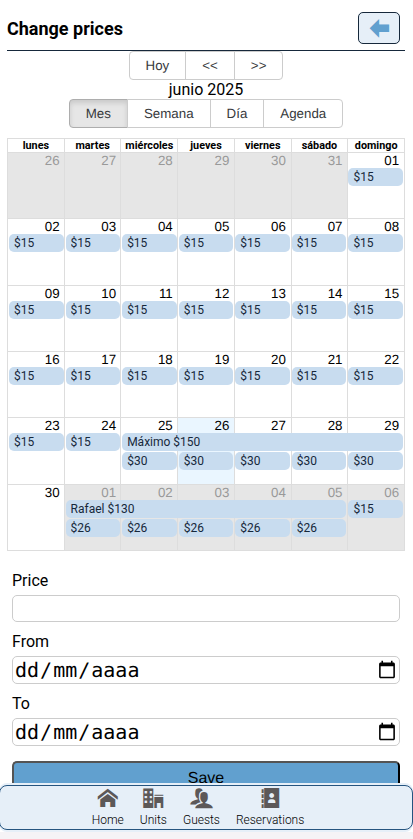
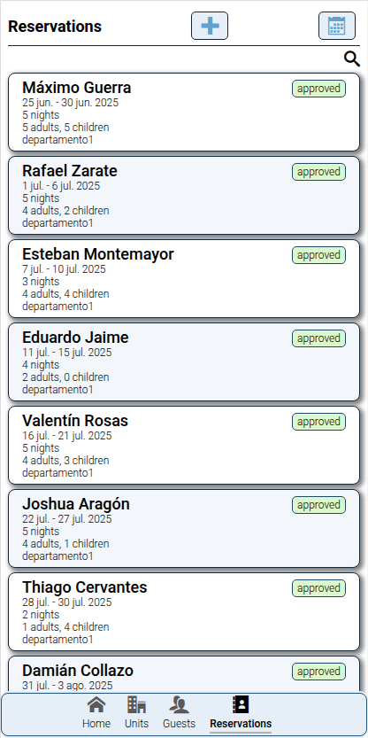
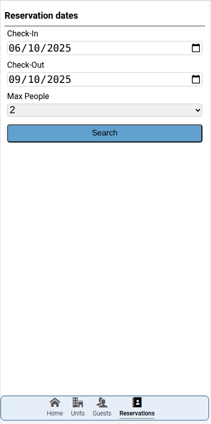
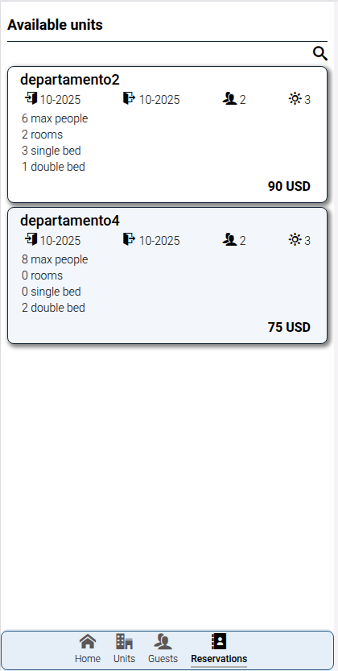
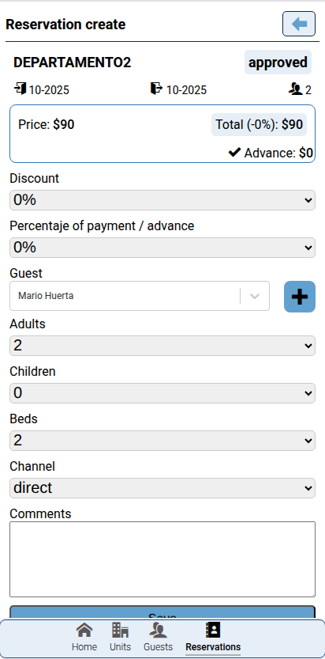

# 🏨 MyBooking Frontend

Frontend for the **MyBooking** accommodation management application, developed in React + TypeScript, using IndexedDB for offline handling, CSS3 with a mobile-first approach, and fully object-oriented.

🔗 Online demo: https://mybooking.edgardoponce.com  
🔗 Frontend repository: https://github.com/guduchango/mybooking-frontend-react  
🔗 Backend repository (Laravel API): https://github.com/guduchango/mybooking-backend-laravel  
🌐 My website: https://edgardoponce.com

---

## 📦 What does this project include?

- Frontend built with React 18 and TypeScript
- Offline management with IndexedDB
- Responsive mobile-first design
- Integration with a Laravel REST API (authentication with Sanctum)
- Management of guests, units, daily unit pricing calendar, reservations
- Multi-user support

---

## 🚀 How to start the project

Prerequisites:
- Node.js >= 18
- Backend running (see the "How to run the backend" section)

Install dependencies:

```
npm install
```

Start the development server:

```
npm run dev
```

By default, the app will be available at: http://localhost:5173

---

## 🗂 Frontend folder structure

```
react-project/
├── src/
│   ├── Components/         Reusable components
│   ├── Context/            Context API
│   ├── Models/             Object-oriented models
│   ├── Pages/              Main views/pages
│   ├── Services/           API and IndexedDB services
│   ├── Utils/              Utilities and constants
│   └── index.tsx           Entry point
└── public/                 Static assets
```

---

## 📸 Project Screenshots

Below you can find screenshots showcasing the main views and functionalities of the MyBooking app.

---

### 🔑 Authentication

<p align="center">
  
</p>

---

### 🏠 Dashboard

<p align="center">
  
</p>

---

### 👥 Guest Management

<p align="center">
  
</p>

<p align="center">
  
</p>

---

### 🏘️ Unit Management

<p align="center">
  
</p>

<p align="center">
  
</p>

<p align="center">
  
</p>

---

### 📅 Reservation Management

<p align="center">
  
</p>

<p align="center">
  
</p>

<p align="center">
  
</p>

<p align="center">
  
</p>

<p align="center">
  
</p>


---

## 🛠️ How to run the backend

The backend is a Laravel API. Clone the repository:

```
git clone https://github.com/guduchango/mybooking-backend-laravel.git
cd mybooking-backend-laravel
```

Install PHP dependencies:

```
composer install
```

Copy the environment file and configure the database:

```
cp .env.example .env
```

Edit `.env` with your credentials and generate the application key:

```
php artisan key:generate
```

Run migrations and seeders:

```
php artisan migrate --seed
```

Start the server:

```
php artisan serve
```

The API will be available at: http://127.0.0.1:8000

### 📂 Laravel folder structure

- app/Http/Controllers       HTTP controllers
- app/Models                 Eloquent models
- database/factories         Test data factories
- database/seeders           Database seeders
- routes/                    Route definitions
- storage/                   Files and logs

---

## 🎯 How to contribute

If you’d like to collaborate:

1. Fork the repository
2. Create a new branch with your improvement or fix
3. Submit a pull request describing your changes

Direct contact: you can write to me through my website https://edgardoponce.com or open an issue on the repository.

---

## 🗒 Task board (Kanban / Tickets)

Currently, there is no public task board.  
I’m considering using GitHub Projects to manage tasks collaboratively.

---

## 🔗 Backend

You can find the backend repository at:  
https://github.com/guduchango/mybooking-backend-laravel

---

## 📄 License

This project is available under the MIT license.

---

## 🙏 Acknowledgments

Thanks to all the open source technologies and libraries that make this project possible.
